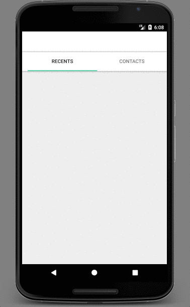

Small modern android app based <b>MVP</b> architecture and bunch or great libraries such as:
* <b>RXJava2</b> - Observer Pattern
* <b>Dagger2</b> - Injection
* <b>ButterKnife</b> - View Injection
* <b>Retrofit</b> - Network
* <b>Room</b> - DB
* <b>RecyclerView</b> - List
* <b>Glide</b> - Images
* <b>PubNub<b> - Notification Service

+
